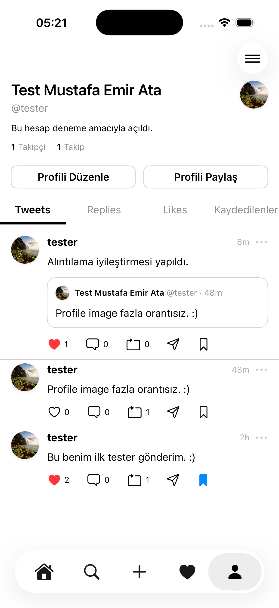
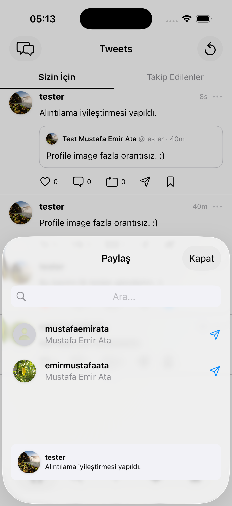
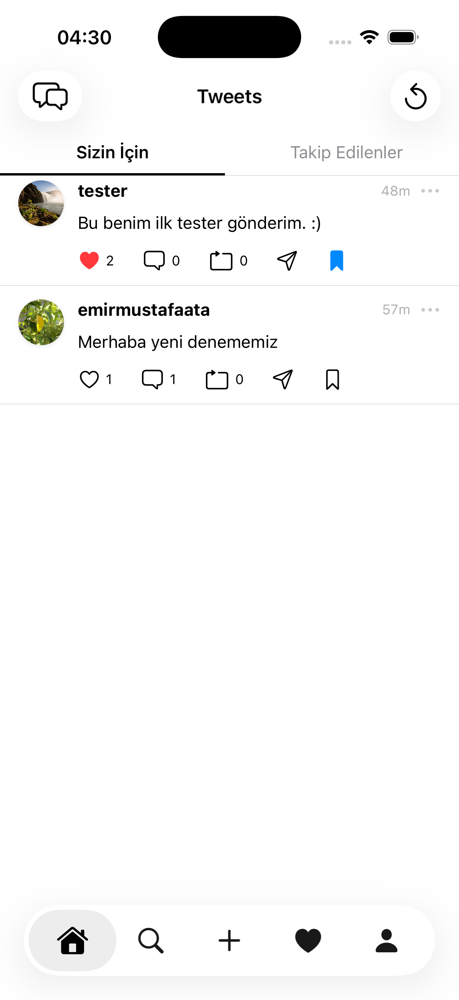
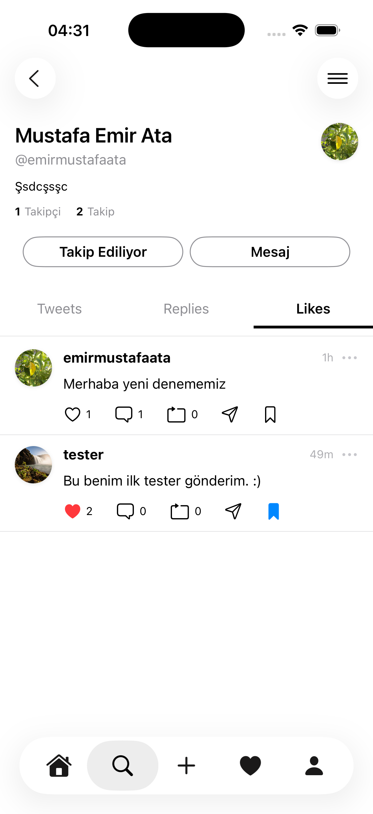
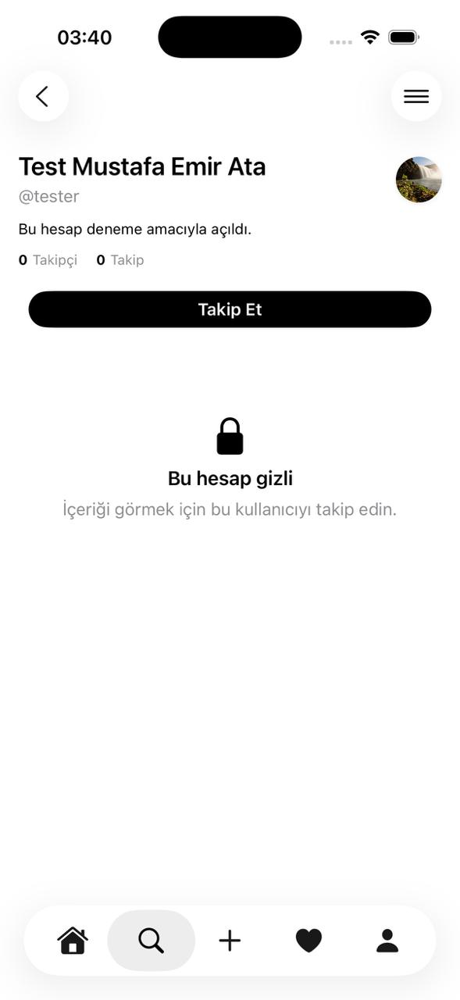

# Tweets – SwiftUI & Firebase (MVVM)

Tweets, SwiftUI kullanılarak MVVM (Model–View–ViewModel) mimarisine uygun şekilde geliştirilmiş, Firebase altyapısı ile çalışan bir iOS sosyal medya uygulamasıdır. Uygulama; tweet paylaşımı, alıntılama, beğenme, kaydetme, takip sistemi, mesajlaşma ve bildirim özelliklerini destekler.

## 📱 Uygulama Ekran Görüntüleri

### Profil Sayfası
Kullanıcı profilinin görünümü  

---

### Tweet Alıntılama
Kullanıcıların paylaşılan tweetleri alıntılayarak etkileşim kurabildiği ekran.
  

---

### Bildirimler
Beğeni, takip ve etkileşimlere ait bildirimlerin görüntülendiği ekran.
  

---

### Tweet Paylaşma
Paylaşılan tweeti arkadaşlara mesaj olarak gönderme ekranı.  

---

### Sizin İçin Akışı
Kullanıcıya özel içeriklerin listelendiği ana akış ekranı.
  

---

### Beğenilen Tweetler
Kullanıcının beğendiği tweetleri görüntüleyebildiği ekran.
  

---

### Gizli Hesap

  

---

## 🛠 Kullanılan Teknolojiler

- SwiftUI  
- MVVM Architecture  
- Firebase Auth  
- Firebase Firestore  

## 🚀 Geliştirme Durumu

Proje aktif olarak geliştirilmektedir. Yeni özellikler ve performans iyileştirmeleri planlanmaktadır.
